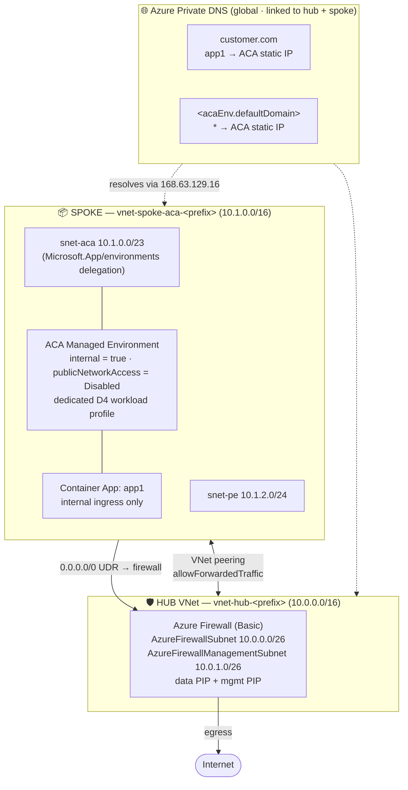

# ACA Architecture Patterns

A collection of **production-style reference architectures for Azure Container Apps (ACA)**,
delivered as **Bicep**. Each pattern is self-contained, compiles clean, and is designed to be
deployed into a lab subscription to demonstrate a specific networking / security posture.

> IaC is **Bicep only**. Templates only — nothing is deployed by cloning this repo.

## Patterns

| Pattern | Summary |
|---------|---------|
| [`aca-private-hub-spoke`](patterns/aca-private-hub-spoke/) | Fully private ACA on a dedicated workload profile in a hub-and-spoke topology. All egress forced through an Azure Firewall (Basic SKU). Name resolution via Azure Private DNS zones for both the emulated customer domain and the ACA default domain. |

---

## Pattern: ACA Private Hub-and-Spoke

Azure Container Apps injected into a private VNet on a **dedicated workload profile**, internal
ingress only, `publicNetworkAccess = Disabled`. A hub VNet hosts an **Azure Firewall (Basic SKU)**
and all spoke egress is forced through it via UDRs. **Azure Private DNS zones** (no DNS server VM)
resolve both `app1.customer.com` and the ACA auto-generated default domain.

### Architecture diagram



<details>
<summary>ASCII fallback</summary>

```
                        ┌──────────────────────────────┐
                        │  HUB  vnet-hub-<prefix>       │
                        │  10.0.0.0/16                  │
                        │  ┌────────────────────────┐   │
                        │  │ Azure Firewall (Basic) │   │
                        │  │  AzureFirewallSubnet    │   │
                        │  │   10.0.0.0/26           │   │
                        │  │  AzureFirewallMgmtSubnet│   │
                        │  │   10.0.1.0/26           │   │
                        │  └───────────┬────────────┘   │
                        └──────────────┴────────────────┘
                                       │  peering
                       ┌───────────────┘
            ┌──────────▼───────────────┐
            │ SPOKE  ACA               │
            │ vnet-spoke-aca-<prefix>  │
            │ 10.1.0.0/16              │
            │  snet-aca 10.1.0.0/23    │
            │   (Microsoft.App deleg.) │
            │  snet-pe  10.1.2.0/24    │
            │  DNS = Azure default     │
            │  Internal ACA env + app1 │
            └──────────────────────────┘

   Azure Private DNS zones (global, linked to hub + ACA spoke):
     • customer.com                 A app1  -> ACA env static IP
     • <acaEnv.defaultDomain>       A *     -> ACA env static IP
```
</details>

### Name resolution

No DNS server VM — resolution is entirely **Azure Private DNS**:

- The **`customer.com`** private zone is authoritative for `app1.customer.com` → the ACA env static IP.
- The **ACA default-domain** private zone (`*.<defaultDomain>` → env static IP) resolves the
  auto-generated `*.azurecontainerapps.io` internal endpoints.
- Both zones are **linked to every VNet** (hub + ACA spoke), so any workload using default Azure
  DNS (`168.63.129.16`) resolves them automatically — no custom VNet DNS servers.

### Everything is private

- ACA environment is **internal** with `publicNetworkAccess = Disabled`.
- Container App ingress is **`external: false`**.
- No public IPs except the firewall's (data + mgmt), required by the Basic SKU.
- Reachable only from inside the VNet mesh (jump host / VPN / ER / peered network).

### Deploy

```bash
cd patterns/aca-private-hub-spoke
./deploy.sh rg-aca-hubspoke australiaeast
```

Full details, routing, firewall rules, and parameters are in the
[pattern README](patterns/aca-private-hub-spoke/README.md).

---

## Repo structure

```
aca-architecture-patterns/
├── README.md                          # this file
└── patterns/
    └── aca-private-hub-spoke/
        ├── README.md                  # pattern deep-dive
        ├── main.bicep                 # hub + firewall + ACA spoke + customer.com zone
        ├── main.bicepparam            # default parameters
        ├── modules/
        │   └── dns.bicep              # ACA default-domain private zone (deferred name)
        └── deploy.sh                  # RG-create + deploy wrapper
```

## Contributing new patterns

Drop a new folder under `patterns/<name>/` with its own `README.md`, Bicep, and `deploy.sh`,
then add a row to the **Patterns** table above. Keep templates lab-safe: no committed secrets,
`az bicep build` must pass clean.
