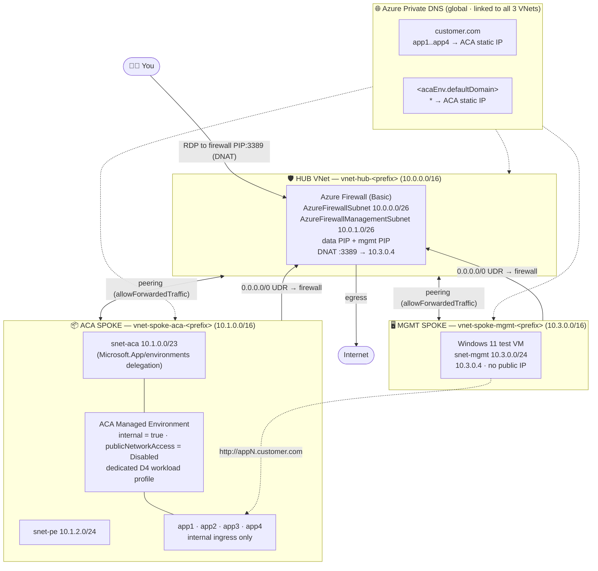

# ACA Architecture Patterns

A collection of **production-style reference architectures for Azure Container Apps (ACA)**,
delivered as **Bicep**. Each pattern is self-contained, compiles clean, and is designed to be
deployed into a lab subscription to demonstrate a specific networking / security posture.

> IaC is **Bicep only**. Templates only — nothing is deployed by cloning this repo.

## Patterns

| Pattern | Summary |
|---------|---------|
| [`aca-private-hub-spoke`](patterns/aca-private-hub-spoke/) | Fully private ACA on a dedicated workload profile in a hub-and-spoke topology. Four internal sample apps (`app1`–`app4`) resolvable at `appN.customer.com` via Azure Private DNS. All egress forced through an Azure Firewall (Basic SKU). A management spoke hosts a Windows 11 test VM reachable over RDP through a firewall DNAT rule. |

---

## Pattern: ACA Private Hub-and-Spoke

Azure Container Apps injected into a private VNet on a **dedicated workload profile**, internal
ingress only, `publicNetworkAccess = Disabled`. The environment runs **four internal sample apps**
(`app1`–`app4`), each resolvable at `appN.customer.com` via **Azure Private DNS zones**. A hub VNet
hosts an **Azure Firewall (Basic SKU)** and all spoke egress is forced through it via UDRs. A
separate **management spoke** hosts a **Windows 11 test VM** (no public IP) reached over **RDP
through a firewall DNAT rule**, which you then use to browse the apps.

### Architecture diagram



<details>
<summary>ASCII fallback</summary>

```
                          +--------------------------------+
        RDP (DNAT)        |  HUB  vnet-hub-<prefix>        |
   you ----------------->  |  10.0.0.0/16                  |
   firewall PIP:3389      |  Azure Firewall (Basic)        |
                          |   DNAT :3389 -> 10.3.0.4       |
                          +------+------------------+------+
                          peering|                  |peering
              +------------------+                  +------------------+
   +----------v-------------+              +---------v----------------+
   | ACA SPOKE 10.1.0.0/16  |              | MGMT SPOKE 10.3.0.0/16   |
   |  snet-aca 10.1.0.0/23  |              |  snet-mgmt 10.3.0.0/24   |
   |  snet-pe  10.1.2.0/24  |              |  Windows 11 VM 10.3.0.4  |
   |  Internal ACA env      |              |   (no public IP)         |
   |   app1 app2 app3 app4  |              +--------------------------+
   +------------------------+

   Azure Private DNS zones (global, linked to hub + ACA spoke + mgmt spoke):
     - customer.com               A app1..app4  -> ACA env static IP
     - <acaEnv.defaultDomain>     A *           -> ACA env static IP
```
</details>

### Name resolution

No DNS server VM — resolution is entirely **Azure Private DNS**:

- The **`customer.com`** private zone holds `app1`–`app4` A-records → the ACA env static IP.
- The **ACA default-domain** private zone (`*.<defaultDomain>` → env static IP) resolves the
  auto-generated `*.azurecontainerapps.io` internal endpoints.
- Both zones are **linked to every VNet** (hub + ACA spoke + mgmt spoke), so any workload using
  default Azure DNS (`168.63.129.16`) — including the Windows 11 VM — resolves them automatically.

### Everything is private (except the firewall + published RDP)

- ACA environment is **internal** with `publicNetworkAccess = Disabled`.
- All four container apps use **`external: false`** ingress.
- Windows 11 VM has **no public IP** — reachable only via the firewall DNAT.
- The only public surface is the firewall's data/mgmt PIPs (mgmt required by the Basic SKU).

### Deploy

```bash
cd patterns/aca-private-hub-spoke
./deploy.sh rg-aca-hubspoke australiaeast
```

Full details, routing, firewall rules, and parameters are in the
[pattern README](patterns/aca-private-hub-spoke/README.md).

---

## Repo structure

```
aca-architecture-patterns/
├── README.md                          # this file
└── patterns/
    └── aca-private-hub-spoke/
        ├── README.md                  # pattern deep-dive
        ├── main.bicep                 # hub + firewall (+DNAT) + ACA spoke (4 apps) + mgmt spoke (Win11 VM) + customer.com zone
        ├── main.bicepparam            # default parameters
        ├── modules/
        │   └── dns.bicep              # ACA default-domain private zone (deferred name)
        └── deploy.sh                  # RG-create + deploy wrapper
```

## Contributing new patterns

Drop a new folder under `patterns/<name>/` with its own `README.md`, Bicep, and `deploy.sh`,
then add a row to the **Patterns** table above. Keep templates lab-safe: no committed secrets,
`az bicep build` must pass clean.
